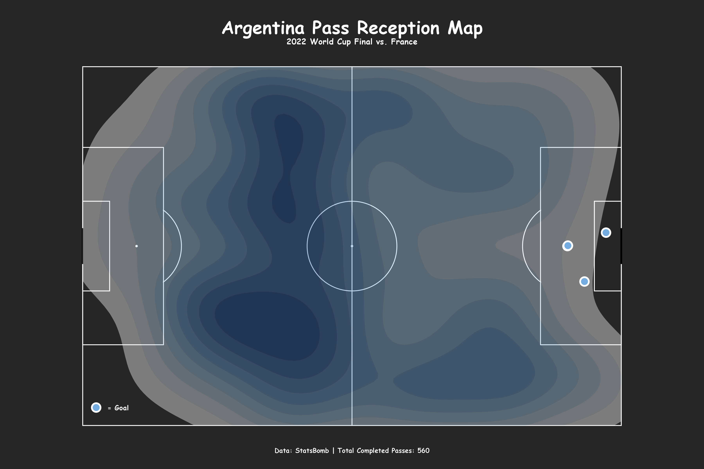
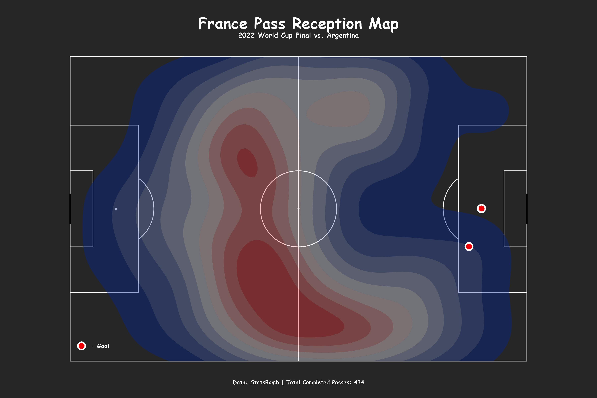

# 2022 World Cup Final: Pass Reception Heatmaps

**By Elijah Wekstein**  
CU Boulder - Business Analytics and Information Management

---

## Overview

With the 2026 World Cup approaching, I wanted to take a look back at the greatest final in recent memory. Argentina vs. France in Qatar 2022 was one of the most dramatic matches in soccer history: a 3-3 draw settled on penalties. Beyond the scoreline, the pass reception maps from that match tell a fascinating tactical story about how two very different teams tried to win the same game.

**Data source:** [StatsBomb Open Data](https://github.com/statsbomb/open-data) - 2022 FIFA World Cup

---

## Tools

- R (StatsBombR, SBpitch, ggplot2, tidyverse)

---

## Visualizations

### Argentina Pass Reception Map

Argentina's pass map shows a team that was comfortable and controlled in possession. The density is spread across their own defensive half and midfield, with notable concentration through the left channel, a reflection of how they built play through that side before transitioning. The right side of the attacking third lights up near goal, where their three scores landed.

---

### France Pass Reception Map

France's map looks completely different. The density clusters heavily through the center and left flank of the pitch, with a pronounced concentration in the central corridor behind midfield. France completed 434 passes to Argentina's 560, but their distribution was more vertical and direct, pushing passes into dangerous central zones rather than circulating possession wide. The three red goal markers on the right side of the attacking third reflect Mbappe's brilliance late in the match.

---

## Key Observations

- **Argentina controlled possession more broadly.** With 560 completed passes vs. France's 434, Argentina circulated the ball more patiently and across more zones of the pitch.
- **France was more central and vertical.** Their pass density clusters through the spine of the pitch, reflecting a more direct and transition-oriented approach.
- **The goal locations tell their own story.** Argentina's goals came from different areas of the box. France's three came from nearly the same zone, driven almost entirely by Mbappe attacking the same channel repeatedly.
- **Argentina owned the left flank.** The density spike through Argentina's left side reflects how they built attacks, with Di Maria and the overlapping fullback creating consistently from that side early in the match.

---

## Repository Contents

| File | Description |
|------|-------------|
| `WorldCup22Map.R` | R script for data pull, processing, and heatmap generation |
| `Argentina_PassMap.png` | Argentina pass reception heatmap |
| `France_PassMap.png` | France pass reception heatmap |
| `README.md` | Project overview and analysis |

---

## About

**Elijah Wekstein** - [LinkedIn](https://www.linkedin.com/in/elijah-wekstein) | [Portfolio](https://ewekstein.github.io)
